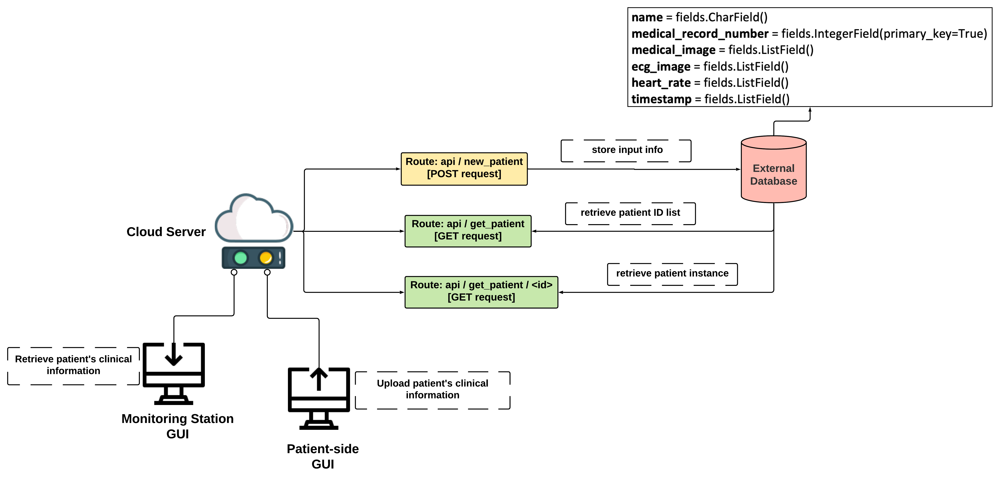
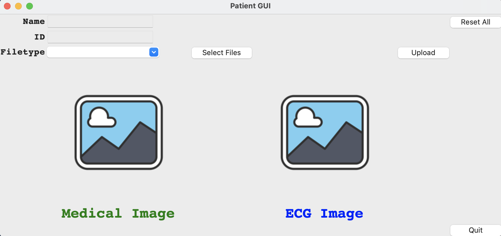
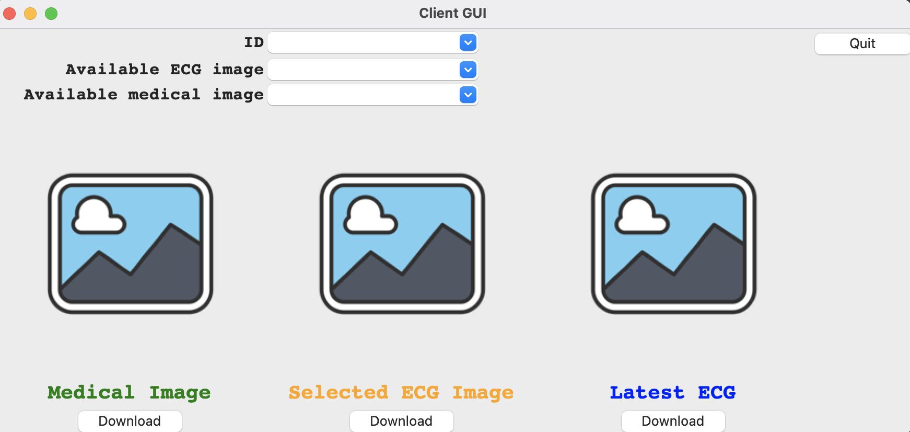

[](https://opensource.org/licenses/MIT)

[](https://github.com/BME547-Fall2021/final-project-jsonify/actions/workflows/pytest_runner.yml)

# Patient Monitoring Client/Server Project


## Introduction
This project utilizes the industry-standard skills taught 
during this semester to implement a Patient Monitoring 
System that has a patient-side client, a monitoring-station
client, and a server/database that allows patient data to 
be uploaded and stored on the server and retrieved for 
ad-hoc and continuous monitoring.

## Operational Design
Our functional Patient Monitoring Server System encompasses with the following essential parts:

**1) Cloud server**, 

**2) Patient-side GUI**, 

**3) Monitor-side GUI**, 

**4) External MongoDB database**


|:--:| 
| *Patient monitoring server system overview design* 


The system operates through the five Python files in this repository: 
- `patient_side_GUI.py`, where the user uploads patients' information and select images;
- `main_server.py`, which receives requests from the patient side/ monitor side to either 
  store into MongoDatabase or return a patient instance;
- `monitor_side_GUI.py`, where the user accesses patient information with medical/ECG images displayed
  on the GUI interface;
- `client.py`, which connects to the server to send out either `POST` or `GET` requests;
- `database_definition.py`, which defines fields of the Patient class in database (`name`, `medical_record_number`, 
  `medical_image`, `ecg_image`,`heart_rate`, `timestamp`).
  
Besides, this repository also contains three unit testing files
for all the functions used in the modules above.


## API Reference Guide for Server

- The cloud server contains 3 routes, where one route receives `POST` request for information storage while
two receive `GET` request to retrieve medical information stored in database. All the relevant functions to
  send requests to server can be found in `client.py`.
  
- The hostname and port on which the server is running is `vcm-23051.vm.duke.edu:5011`
  
### Route: Upload Medical Information [POST request]
- This route is design for new patient registration and update new medical information for existed patient records. All the
data will be stored to external MongoDB database.
  
- This route takes the below JSON format string:
  ```
   {      
        "name": str,
        "medical_record_number": int,
        "medical_image": b64-string,
        "ecg_image": b64-string,
        "hr": int
  }
  ```
  
- The URL to access this route is `http://vcm-23051.vm.duke.edu:5011/api/new_patient`


### Route: Retrieval of Available Medical Record Numbers [GET request]
- This route is design to return a lists of available medical record numbers from MongoDB database.

- The URL to access this route is `http://vcm-23051.vm.duke.edu:5011/api/get_patient`


### Route: Retrieval of a Specific Patient's Instance [GET request]
- This route is design to return a patient's medical information containing with name, ID, history of 
heart rates and their corresponding timestamps, ECG images and medical images, given the input of 
  ID. 

- The URL to access this route is `http://vcm-23051.vm.duke.edu:5011/api/get_patient/<id>`


## Database Structure 
- The MongoDB database has the fields: `name`, `medical_record_number`, 
  `medical_image`, `ecg_image`,`heart_rate`, `timestamp`, which are self-descriptive by the names
  
- The database field definition shown as follow:
```
      name = fields.CharField()
      medical_record_number = fields.IntegerField(primary_key=True)
      medical_image = fields.ListField()
      ecg_image = fields.ListField()
      heart_rate = fields.ListField()
      timestamp = fields.ListField()

```

## Descriptions & User Instructions
### Patient-side Graphical User Interface
- The patient-side GUI is intended to upload patients' medical information by entering patient's name, id/
medical record number in the text entries respectively. In addition, users can also select medical image (*.jpeg/ *.png) or raw
  ecg data (*.csv) to display on GUI and upload them to established MongoDB database. For the selection of raw ecg
  data, the ecg raw data will be plotted and shown on the interface, along with the estimated heart rate. The GUI can display one medical image and one ecg
  image simultaneously.


#### Instruction
1) To activate the GUI, users need to run the `patient_side_GUI.py` script. One way to do that is by typing `python patient_side_GUI.py` on
the terminal or open your preference IDE platform for python and run the script.


2) The GUI window will show up shortly after running the script.


|:--:| 
| *Patient-side GUI interface design* 

3) Input the subject's `Name` if any and the patient `ID` correspondingly.


4) Make sure to select the file type from the drop-down list of `Filetype` combobox prior to clicking the `Select Files` button to choose file to be uploaded.
Otherwise, a warning message box will appear to prompt the user to select file type first.


6) If necessary, click the `Reset All` button in the upper right corner to clear all the information entered on the interface so far.


7) When the user is satisfied with current input, click the `Upload` button
to upload the entered information to cloud database, and then everything on the interface will be removed.


8) Click the `Quit` button to exit the interface. 
Then, click `No` in the confirmation window to go back to the interface when accidental pressing;
or click `Yes` to completely close the interface window.
   
**Note**:

**i. Empty ID entry would render upload failure**

**ii. If entering a new ID, message will indicate `New patient registered`**

**iii. New info updates will be made to the existed medical record number**


## Monitor-side Graphical User Interface

- The monitor-side GUI is intended to retrieve a particular patient's medical information given
an input ID / medical record number. Upon the user chooses a medical record number from a list, a text message specifying
  patient's name, id, latest hear rate and its timestamp will automatically be shown on the top of the interface, along with
  latest ecg image if available. The users can also select from a whole list of ecg or medical images and visualize on GUI interface.
  Users have the options to download displayed images locally as well. 
  
#### Instruction
1) To activate the GUI, users first need to make sure `main_server.py` is running and the connection is built with the cloud Mongo database.
And then, run the `monitor_side_GUI.py` script. One way to do that is by typing `python monitor_side_GUI.py` on
the terminal or open your preference IDE platform for python and run the script.


2) The GUI window will show up shortly after running the script.


|:--:| 
| *Monitor-side GUI interface design* 


3) Select an ID number from `ID` dropdown box. The patient information and latest ECG image will automatically display.


4) In addition, select a historical ECG images from the drop-down list of `Available ECG image` combobox.
The selected image will display in the Selected ECG Image area.


5) Select a medical image from the drop-down lists of `Available medical image` combobox.
The selected image will display in the Medical Image area.


6) Click the `Download` under which image the user would like to save.
Choose a local directory in the pop-up directory selection window,
and enter a filename in the subsequent dialog window to save the selected image.


7) To get information of a new patient, simply change the selection of patient number in the `ID` combobox.
Any old information will be removed or replaced by the starting information of the new patient.


8) Click the `Quit` button to exit when the user is done using this interface. 
Click `No` in the confirmation window to go back to the interface when accidental pressing;
or click `Yes` to completely close the interface window.

   
**Note**:

**i. The GUI will automatically update info for the selected patient ID every 5s**


## Video Demos
[Patient_side GUI Demo](https://duke.zoom.us/rec/share/Ho2S2FfMplVXUvqzkQigpIGKQdnzLT6QsfZQJoahF5UoqqadLHyvqYmdooJYJlZe.Gsiqix7uc18oNH86)

[Monitor_side GUI Demo](https://duke.zoom.us/rec/share/Gn4auEPDpbHZVXAnVCYdfo_Hi6D8lq5vZ4zNDx5pH3mwlImcK5l-6KTI0Yk-TLg.pZaRFD3b92M3cZac?startTime=1638758351000)


## Copyright
 License under the [](https://opensource.org/licenses/MIT)
  
  


  


